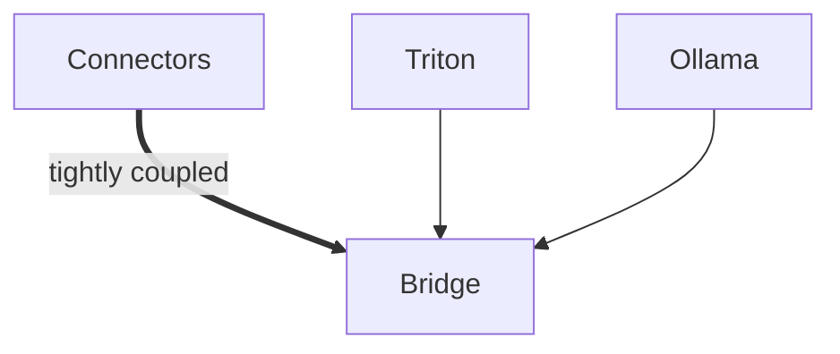

# Bridge

> The notes directory is compatible with Obsidian. To use this with Obsidian, open the directory as an Obsidian vault from within the app. Run the notes-vcs.py to synchronize notes across the repo with the vault (under development).

> The dev folder holds experiments, and related non-production ready code.

## Contributing
- Please do not push artifacts to the repo (this includes files like *.db, *.json, *.yml) unless its absolutely necessary.
- Keep in mind that Bridge is designed to be a search system. Do not burden it with things like auth. Bridge should only do the following:
    - Connect with data sources (pg, mysql, kafka, etc)
    - Process, compile, link data asynchronously
    - Search
    - Be highly available
- Any special logic for custom use cases should be implemented in forks, not branches.

See below for the current set up.

Please note that Ollama, and Triton servers are not a part of Bridge. Instead, they are external pieces that only exist to help manage models. Running an inference for example does not fall into the category of any of the defined actions of Bridge.
